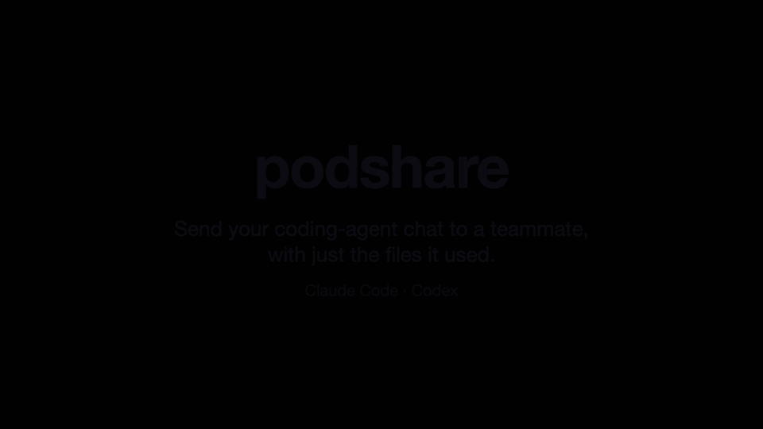

# podshare

Send your coding-agent chat to someone else, so they can pick up where you left off.
The conversation goes with **just the files that chat used**, not your whole project,
plus your project's instructions (like `CLAUDE.md` or `AGENTS.md`) and **the skills the chat
used**, so the other agent works the same way. Everything is encrypted, and secrets and personal
details podshare recognises are removed.

Works with **Claude Code** and **Codex**, and a chat can move between them.



## 1. Install

Both of you need podshare: you to send, and the other person to receive. Open a terminal
(Terminal on Mac, PowerShell on Windows) and run the line for your computer:

| Your computer | Run this |
|---|---|
| Mac | `brew install noclipper/tap/podshare` |
| Linux or Mac without Homebrew | `curl -LsSf https://github.com/noclipper/podshare/releases/latest/download/podshare-installer.sh \| sh` |
| Windows (PowerShell) | `powershell -ExecutionPolicy Bypass -c "irm https://github.com/noclipper/podshare/releases/latest/download/podshare-installer.ps1 \| iex"` |
| Anything with Node.js | `npm install -g podshare` |

Check it worked: `podshare --version`. You also need Claude Code or Codex, the agent you
chat with.

## 2. Send a chat

In a terminal, go to the project folder you used the agent in, then run `podshare send`:

```sh
cd ~/my-project
podshare send
```

1. If you've had several chats in that folder, pick the one to send (arrow keys, Enter).
2. You see what will go: the files, what's left out and why, and roughly how many tokens
   it is. Press `d` for the full report, `c` to untick files.
   If the chat used skills from your own setup (not the project's), podshare asks whether
   to send them too.
3. Press `y`. You get a one-time code like `7-crossover-clockwork`.
4. Send that code to the other person (Slack, text, anything).
5. **Keep the terminal open** until they've received it. It says `✓ sent` when done.

## 3. Receive a chat

In a terminal, go to the folder where you want the project to appear (for example
`~/Projects`), then run `podshare receive` with the code you were given:

```sh
cd ~/Projects
podshare receive 7-crossover-clockwork
```

1. You see what's coming (project, messages, tokens, files, size). Press Enter to accept.
2. If you have both Claude Code and Codex, pick which one continues the chat.
3. It unpacks into a new folder (`my-project`, or `my-project-2` if that name is taken)
   and shows the instructions that will steer the agent. Press Enter to unpack.
4. Your agent opens with the chat, right where the sender stopped. It starts in **plan
   mode** (Claude Code) or **read-only** (Codex): it can read the files but won't change
   anything until you approve.

A chat started in Claude Code can continue in Codex, and the other way round.

**Not online at the same time?** Make a file instead, and send it however you like:
`podshare pack` creates a file like `my-project-1a2b3c4d.pod` and prints the exact `podshare open …` command the
other person runs. Give them the file and that command.

## Use it without the terminal (Claude Code or Codex plugin)

If you'd rather stay inside your agent, add the podshare plugin. You still need step 1
(podshare installed); the plugin runs it for you.

**Claude Code:** type these two lines into Claude Code's chat box:

```
/plugin marketplace add noclipper/podshare
/plugin install podshare@podshare
```

Then, in any chat, type `/podshare:share` to send it, or `/podshare:receive <code>` to
receive one.

**Codex:** run these two lines in a terminal:

```sh
codex plugin marketplace add noclipper/podshare
codex plugin add podshare@podshare
```

Then, in any Codex chat, ask: "share this chat with podshare", or "receive podshare code
7-crossover-clockwork". Codex may ask permission to use the network; say yes.

## What stays private

Before anything is sent, podshare removes:

- passwords, API keys and other secrets it recognises
- your name, email, username and computer name from the chat (project files that
  mention you are flagged, not changed)
- `.env` files, keys and anything in personal folders
- commands and tool results it can't check

You see the full list first, and you can untick any file (press `c`).
The code works only once, and everything is encrypted end to end.
[More about privacy →](docs/privacy.md)

## Good to know

- Only the files the chat used are sent, plus build files like `package.json` or
  `Cargo.toml` so the project runs. Not your whole project.
- Skills go along too: the project's own (`.claude/skills`, `.agents/skills`) always, and
  ones from your own setup or a plugin only if you say yes. They land where the other
  person's agent looks, whichever agent that is. A received skill can't pre-approve tools.
- The person you send to starts safely (plan mode in Claude Code, read-only in Codex),
  so it can read the files but changes nothing until they approve.
- `--yes` skips the questions and sends your most recent chat.
- Works on macOS, Linux and Windows.
- To update: `brew upgrade podshare`, `npm update -g podshare`, or run the install line again.

## Limits

- Files over 10 MB are left out unless you say so (podshare asks, or use `--allow large-files`).
  Files over 1 GB are always left out.
- A pod can be up to 2 GB.
- To send by code, you both need to be online at the same time. Otherwise use `pack` and `open`.
- Claude Code and Codex only, for now.
- A very long chat may be summarised by the receiving agent.

## Coming soon

- Gemini CLI
- Send-later links, so the other person doesn't need to be online
- Big files sent as a link to your git repo instead of the file itself

## Support

podshare is free. If it saves you time, you can [sponsor it on GitHub](https://github.com/sponsors/noclipper),
once or monthly.

### Supporters

None yet! Be the first!

## License

[FSL-1.1](LICENSE.md): free to use, just don't sell a competing product with it.
Becomes Apache-2.0 two years after each release.
